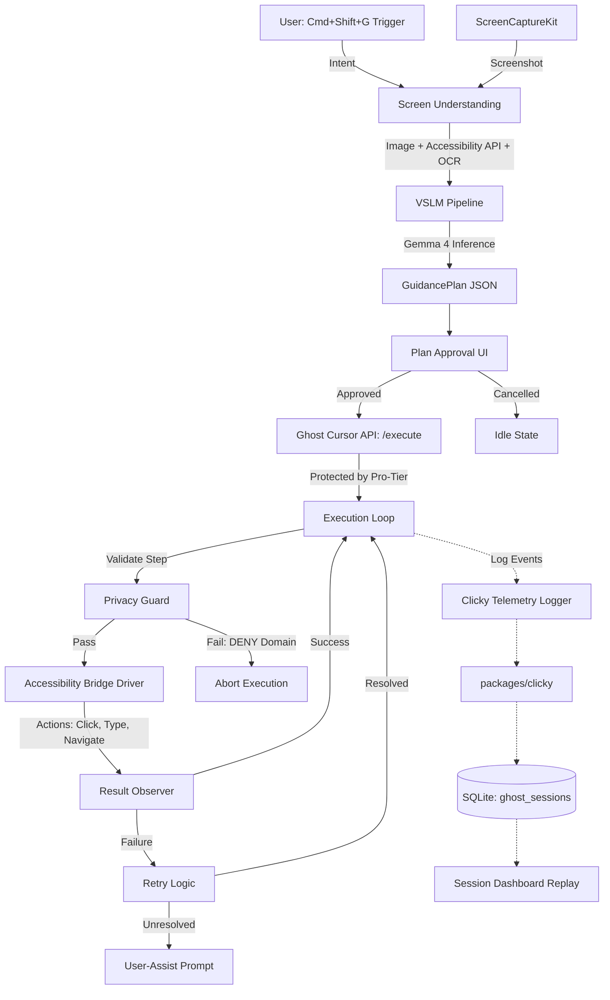

# Ghost Cursor Architecture Report
**Status**: Built (Sprint 4.3)

This report documents the fully implemented, repository-verified architecture of the SHAIL Ghost Cursor feature.

## Repository Layout
The Ghost Cursor implementation is divided between the `apps/ghost-cursor` module and the cloned Clicky telemetry package. The architectural layout deviates slightly from the initial roadmap by flattening the `planner` and `models` directories into root-level Python files within the app module, simplifying the internal package structure.

```
shail/
├── apps/
│   └── ghost-cursor/
│       ├── api/
│       │   └── routes.py              # FastAPI endpoints (/execute, /sessions)
│       ├── execution/
│       │   ├── loop.py                # Core execution state machine
│       │   ├── interfaces.py          # Abstractions (OverlayRenderer, etc.)
│       │   ├── privacy_guard.py       # DENY domain enforcement
│       │   └── adapters/              # Native OS interactions (AccessibilityBridgeDriver)
│       ├── validation/
│       │   ├── observer.py            # ResultObserver for success confirmation
│       │   └── failure_diagnostics.py # Telemetry context bridging
│       ├── telemetry/
│       │   ├── telemetry_logger.py    # Base interface
│       │   ├── clicky_telemetry_logger.py # Concrete Clicky integration
│       │   ├── development_telemetry_logger.py # Debug logger
│       │   └── storage.py             # SQLite session storage
│       ├── models.py                  # GuidancePlan JSON schema
│       ├── ocr_extractor.py           # Tesseract/macOS Vision
│       ├── screen_understanding.py    # Context builder
│       └── vslm_pipeline.py           # Gemma 4 multimodal inference
└── packages/
    └── clicky/                        # Cloned open-source telemetry engine
```

## System Architecture and Data Flow

The Ghost Cursor architecture consists of five core subsystems, fully decoupled through explicit interfaces. The execution flow begins when a user triggers the intent via the macOS native `Cmd+Shift+G` shortcut.



## Subsystems

1. **Screen Understanding Engine (`screen_understanding.py`, `ocr_extractor.py`)**
   Captures the screen state using ScreenCaptureKit and extracts interactive elements via macOS Accessibility APIs and Tesseract OCR. This data, alongside the user's intent, forms the grounding context.

2. **VSLM Pipeline (`vslm_pipeline.py`)**
   Processes the screen context and user intent through a local, multimodal small language model (Gemma 4 via Ollama) to generate a structured `GuidancePlan` adhering to the schemas defined in `models.py`.

3. **Execution Engine (`execution/loop.py`, `execution/adapters/`)**
   Orchestrates the step-by-step playback of the `GuidancePlan`. It utilizes the `AccessibilityBridgeDriver` to dispatch native `CGEvent` instructions (clicks, keystrokes) to the operating system. Crucially, it interfaces with `privacy_guard.py` to abort execution if a DENY domain (e.g., banking, health) is detected.

4. **Result Observer (`validation/observer.py`)**
   Validates the outcome of each execution step by polling the system state. If an action fails (e.g., element not found), the retry logic triggers. If the retry fails, execution pauses, surfacing a user-assist prompt.

5. **Clicky Telemetry Integration (`telemetry/clicky_telemetry_logger.py`, `packages/clicky/`)**
   A specialized implementation of the `TelemetryLogger` interface that wraps the cloned open-source Clicky engine. It records execution events (clicks, scrolls, hovers) into `ghost_sessions.db` (SQLite) for dashboard replay and failure diagnostics, fully decoupled from the core execution loop.
